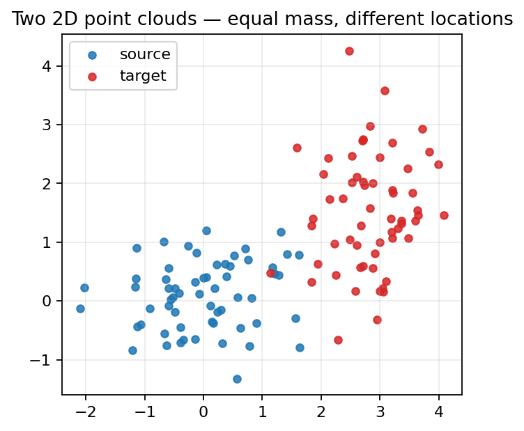
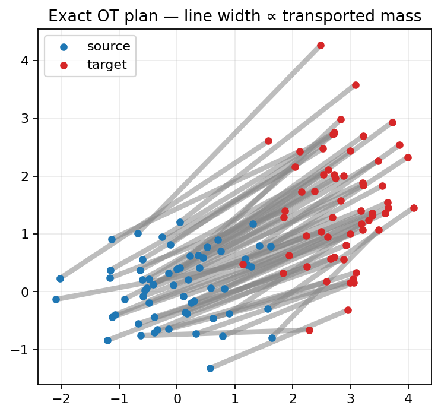
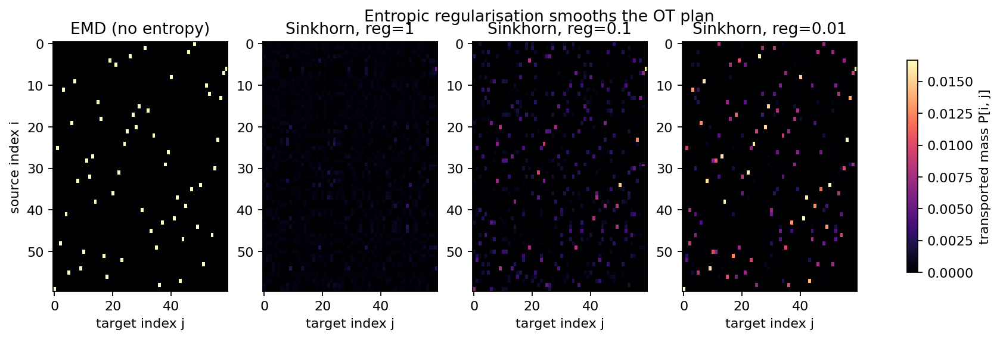
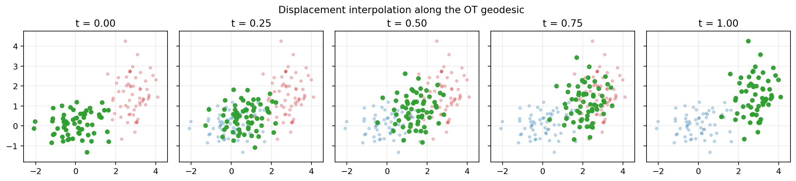

# Chapter 1 — Optimal transport, from a pile of sand to a working solver

## Why this exists

In Chapter 0 we set up the question: can we move interpretability artifacts — steering vectors, refusal directions — from one language model to another, when the two models don't share a coordinate system? The answer we're betting on involves *optimal transport*. Before we can use OT to align two LLMs, you and I need to understand what OT actually is — what problem it solves, what equation it minimises, what algorithm it uses, and what its output looks like.

This chapter does that, in the simplest possible setting: two tiny clouds of dots in two dimensions, with the most obvious cost function imaginable (the squared distance between dots). By the end you should be able to read a paper that says "we compute the Wasserstein distance" and know exactly what computation that names.

Almost everything in the rest of the project is built on top of what we cover here.

## A worked example you can hold in your head

Picture two heaps of sand on a long table.

The heap on the left has its centre around the origin. The heap on the right is centred a couple of metres away. Both heaps weigh exactly the same — say, one kilogram each. Your job is to convert the left heap into the right heap by carrying sand. Moving a grain costs you energy, and the energy goes up with distance. The cheapest plan — the one that uses the least total work — is the *optimal transport plan*. The total work it requires is the *Wasserstein distance* between the two heaps.

That's the entire idea. The math we're about to do just makes that picture precise enough for a computer.

We will represent each heap not as a continuous pile but as a finite cloud of point masses — 60 dots for our two heaps, each carrying $1/60$ of the total weight. That makes everything discrete and easy to think about. Squared Euclidean distance is the cost: moving a dot from $x \in \mathbb{R}^2$ to $y \in \mathbb{R}^2$ costs $\|x - y\|^2$. (Why squared? Because under that choice the optimal transport plan, when both clouds are Gaussians, is a *linear* map — namely the difference-in-means translation. Chapter 4 turns on exactly that fact.)

You can see the two clouds we will work with for the rest of the chapter here:

## The math, slowly

We have two histograms: $a \in \mathbb{R}^n$ on the source side and $b \in \mathbb{R}^m$ on the target side, with $n = m = 60$ in our running example, $a_i = 1/n$, $b_j = 1/m$, and both summing to 1. We have a cost matrix $M \in \mathbb{R}^{n \times m}$ with $M_{ij} = \|x_i - y_j\|^2$.

We want to find a *transport plan* $P \in \mathbb{R}^{n \times m}_{\geq 0}$ where $P_{ij}$ is the amount of mass we ship from source point $i$ to target point $j$. The plan must respect the supply at each source and the demand at each target — that is, the rows of $P$ must sum to $a$ and the columns must sum to $b$:

$$\sum_j P_{ij} = a_i \quad \text{for all } i, \qquad \sum_i P_{ij} = b_j \quad \text{for all } j.$$

(A *transport plan* is sometimes also called a *coupling*; the words are interchangeable.)

Among all plans that satisfy those marginal constraints, we want the one that minimises the total cost:

$$\min_{P \in U(a, b)} \langle P, M \rangle \quad := \quad \min_{P \in U(a, b)} \sum_{ij} P_{ij} M_{ij}.$$

Here $U(a, b)$ is the *transport polytope*: the set of non-negative matrices with row sums $a$ and column sums $b$. The bracket notation $\langle P, M \rangle$ is just the Frobenius inner product — element-wise product summed over all entries.

This is the **Kantorovich problem**, and it is a linear program (LP). The objective is linear in $P$, the marginal constraints are linear equalities, and the non-negativity constraints are linear inequalities. So any general-purpose LP solver can crack it. In `phases/phase_01_ot_foundations/scratch_ot.py` we do exactly that — flatten $P$ into a vector of $nm$ variables, assemble the $(n+m) \times nm$ equality constraint matrix, hand it to `scipy.optimize.linprog`, and read off the optimal cost. The point of that file is not to be fast (it isn't — it's $O(n^2 m^2)$ ish memory just to assemble the constraints), but to be readable. The production solver uses POT's specialised network-flow algorithm, which exploits the structure of the LP and is dramatically faster.

The picture below shows the optimal plan for our two clouds. Every line is a non-zero entry of $P$; line width is proportional to how much mass moves along that edge.

Two things to notice. First, almost every line is the same width — that's because $a_i = b_j = 1/n$ and a basic theorem of OT says the optimal plan in this *equal-and-uniform* case is a *permutation*: each source point sends all its mass to exactly one target point. Second, the assignment is *not* random; it respects geometry. Source points on the upper-left of their cloud get matched to target points on the upper-left of theirs. OT preserves structure.

## Why we need entropic regularisation

Solving the LP exactly gets expensive fast. For $n = m = 1000$ — a small problem by ML standards — the constraint matrix is millions of entries, and even with the cleverest network-flow algorithm we're at $O(n^3 \log n)$ in the worst case. For large $n$, this becomes prohibitive.

There is a beautiful trick due to Marco Cuturi (2013) that turns this hard combinatorial problem into something much friendlier: add a tiny entropy bonus to the objective. Define the *entropy* of a plan $P$ as

$$H(P) = -\sum_{ij} P_{ij} \, \big( \log P_{ij} - 1 \big),$$

and minimise

$$\min_{P \in U(a, b)} \langle P, M \rangle - \varepsilon H(P)$$

instead. Here $\varepsilon > 0$ is a tunable regularisation strength. (You'll see this called the *entropic OT* or *Sinkhorn* objective.)

Two things happen.

First, the regularised problem becomes *strictly convex*, so it has a unique solution. The unregularised LP can have multiple optimal plans when the cost matrix has ties; that messes up algorithms that follow gradients. Adding entropy regularisation makes the loss surface bowl-shaped and the answer crisp.

Second — and this is the magic — the optimal plan has a closed form. It must look like

$$P^*_{ij} = u_i \cdot K_{ij} \cdot v_j, \qquad K_{ij} := \exp(-M_{ij} / \varepsilon),$$

for some positive vectors $u \in \mathbb{R}^n_{>0}$, $v \in \mathbb{R}^m_{>0}$. (This is a Lagrangian calculation; the duals of the marginal constraints become exactly the $\log u$ and $\log v$.) The matrix $K$ is fixed once you have $M$ and $\varepsilon$; the algorithm just has to find the right scalings $u$ and $v$.

Finding them is the *Sinkhorn iteration*:

1. Start with any positive $u, v$.
2. Set $u_i \leftarrow a_i \,/\, \sum_j K_{ij} v_j$ for all $i$. (Now row sums are correct.)
3. Set $v_j \leftarrow b_j \,/\, \sum_i K_{ij} u_i$ for all $j$. (Now column sums are correct, but the row update broke a tiny bit.)
4. Repeat until both marginals are satisfied to within tolerance.

That's the entire algorithm. Each iteration is two matrix-vector products, so the per-iteration cost is $O(nm)$, dwarfing the LP. Convergence is geometric in the marginal violation, so a few hundred iterations is usually plenty.

This is the *matrix scaling* problem in disguise — exactly the problem that comes up in iterative proportional fitting (RAS algorithm) for contingency tables, and the same algorithm Sinkhorn rediscovered in 1964 for the doubly-stochastic version. The framing as OT is Cuturi's contribution; the maths goes back much further.

There is one numerical gotcha. When $\varepsilon$ is much smaller than $\max(M)$, the entries of $K = \exp(-M/\varepsilon)$ underflow to zero, and the division in step 2 becomes $0/0$. The fix is to do everything in log-space: store $\log u, \log v, \log K$, and use the log-sum-exp identity to compute $\log(K v)$ stably. That's what `phases/phase_01_ot_foundations/scratch_sinkhorn.py` does, and it's what POT does when you ask for `method='sinkhorn_log'`. Use it. The non-log version is faster but a foot-gun.

The picture below shows what entropic regularisation looks like as we sweep $\varepsilon$ from large to small. The EMD plan on the left is sparse — almost every entry is zero. At $\varepsilon = 1.0$ the plan is so blurred it's almost the uninformative product of marginals (every source point sends a little mass to every target point). At $\varepsilon = 0.01$ it's sharp again and visually close to the EMD reference.

So there's a knob. Smaller $\varepsilon$: closer to true OT, harder to solve numerically, sparser plan. Larger $\varepsilon$: blurrier plan, faster convergence, more robust. We will come back to this trade-off every time we use Sinkhorn downstream.

## The OT plan is a geodesic

We've only computed plans so far, not anything that looks like a *transformation*. But the plan does give us a transformation, and it's a beautiful one.

For each source point $x_i$, the OT plan tells us how its mass is distributed across the target points: row $i$ of $P$ is exactly that. Take the centre of mass of that distribution and call it the *barycentric image* of $x_i$:

$$T(x_i) = \frac{1}{a_i} \sum_j P_{ij} \, y_j.$$

In our uniform case $a_i = 1/n$, so $T(x_i) = n \sum_j P_{ij} y_j$. In the special permutation regime (equal-mass, no ties) the barycentric image is exactly the target point $x_i$ gets matched to. In general it's a weighted average.

Now we can interpolate between the source cloud and its barycentric image by moving each source point a fraction $t \in [0, 1]$ of the way to its image:

$$x_i(t) = (1 - t) \, x_i + t \, T(x_i).$$

This is *displacement interpolation* (also called McCann's interpolant), and it is the OT-native answer to "show me halfway between these two distributions." Linear interpolation in the *vector* sense — averaging the two histograms element-wise — would give you a bimodal mush that lives nowhere either heap lives. Displacement interpolation gives you the heap-of-sand actually slid halfway across the table:

This is the picture you should hold in your head every time you see "transport map" later in the project. It's a continuous deformation that takes one distribution to another, and it falls out of the OT plan for free.

## POT as the production solver

Everything in the previous sections you and I now understand from scratch. The `scratch_*.py` files in this phase folder solve OT in plain NumPy/SciPy, and the tests in `tests/ot/` confirm they agree with POT to within numerical tolerance on small instances.

For everything downstream, we use POT. Concretely:

- `src/ot_steering/ot/emd.py` exposes `solve_emd(a, b, M, cfg)` — a thin wrapper around `ot.emd` with a pydantic `EMDConfig`. The config validates inputs at construction time (positive thread count, positive iteration limit, marginal-check toggle) so a typo in YAML fails immediately.
- `src/ot_steering/ot/sinkhorn.py` exposes `solve_sinkhorn(a, b, M, cfg)` — a wrapper around `ot.sinkhorn` defaulting to the log-domain variant, with a `SinkhornConfig` for `reg`, `method`, `num_iter_max`, `stop_threshold`, and a `warn_on_no_convergence` toggle for cases where we know we're solving an aggressive problem.

The notebook in this folder (`notebook.ipynb`) imports the same demo module the figure-generation script uses. Run it top to bottom to reproduce every figure in this chapter and to play with the regularisation knob yourself.

## What we just learned

- Optimal transport asks: given two distributions and a cost of moving mass, what is the cheapest plan to convert one into the other? The answer is the *Wasserstein distance*; the plan is a *coupling* / *transport plan*.
- Discrete OT is a linear program — solvable from scratch with `scipy.optimize.linprog`, solvable fast with POT's network-flow algorithm.
- Sinkhorn replaces the LP with a regularised problem whose solution has the closed form $P = \mathrm{diag}(u) \, K \, \mathrm{diag}(v)$ where $K = \exp(-M/\varepsilon)$. Two cheap matrix-vector products per iteration; geometric convergence; do it in log-space to stay numerically safe.
- The plan defines a *barycentric map* and hence a *displacement interpolation* — a real, smooth, geometrically meaningful path between the two distributions. This is the thing we will steer with.
- POT (`pip install pot`) is the canonical implementation. Our `src/ot_steering/ot/` is a thin pydantic-validated wrapper around it.

## Go deeper

- *Optimal Transport for Applied Mathematicians* — Filippo Santambrogio. The Kantorovich problem, the duality, the metric properties of $W_p$. Chapters 1–3 are the right entry point.
- *Computational Optimal Transport* — Peyré & Cuturi (open access). The reference for everything algorithmic about Sinkhorn, including log-domain stabilisation and the relationship to matrix scaling. Chapter 4 is what we derived above.
- Cuturi (2013), *Sinkhorn Distances: Lightspeed Computation of Optimal Transport.* NeurIPS. The paper that brought Sinkhorn into ML. Worth reading for the framing alone.
- Jean Feydy's PhD thesis (2020), *Geometric data analysis, beyond convolutions.* The most readable single source on log-domain Sinkhorn, debiased Sinkhorn divergences, and the GPU-friendly implementations behind `geomloss`.
- POT documentation: <https://pythonot.github.io/>. Skim the `ot.emd` and `ot.sinkhorn` pages; they list every solver knob we wrap.

## What's next

Chapter 2 generalises everything we did here to the case where the source and target distributions live in *different* spaces — different dimensions, different units, no shared coordinate frame. That generalisation is **Gromov–Wasserstein**, and it is the tool we actually need for cross-LLM steering. See `phases/phase_02_gromov_wasserstein/chapter.md`.
