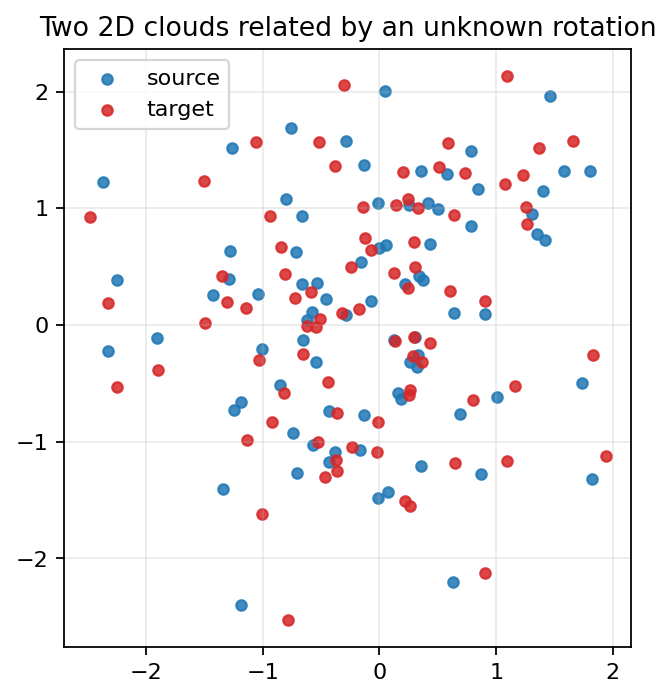
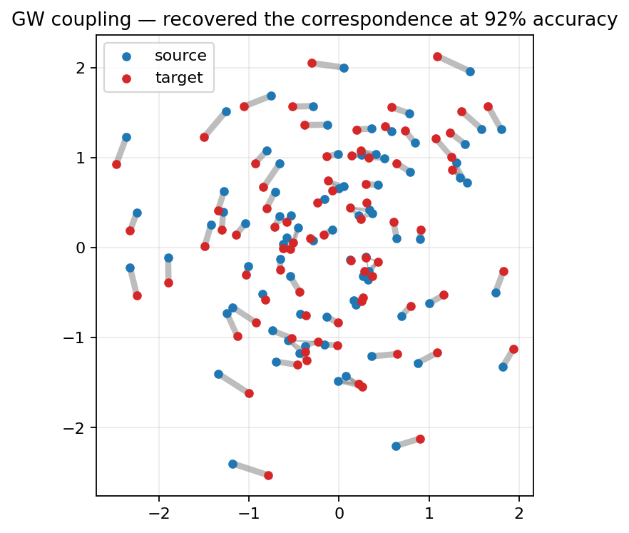
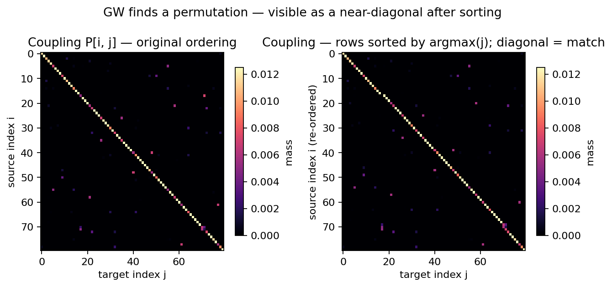
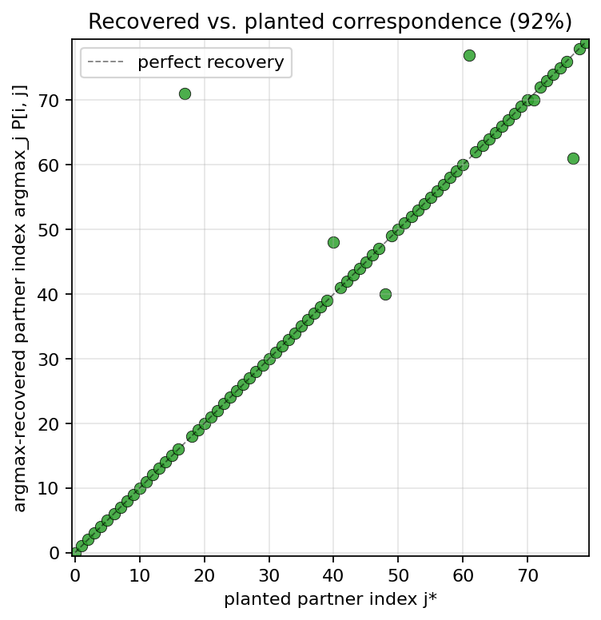

# Chapter 2 — Gromov-Wasserstein: matching across incomparable spaces

## Why this exists

Chapter 1 left us with a working algorithm for moving mass from one distribution to another, *provided we can compute the cost of moving a single grain*. That qualifier is doing real work. The whole formulation needs a number $M_{ij}$ for every pair of source point $i$ and target point $j$. In Chapter 1 we used $M_{ij} = \|x_i - y_j\|^2$, the squared Euclidean distance — and that worked because both clouds lived in the *same* $\mathbb{R}^2$.

In this project, the two distributions whose alignment we actually care about are the residual-stream activations of two different language models. They do not live in the same space. They don't even live in spaces of the same dimensionality, generally. Asking "what is the squared distance between activation vector $x_i \in \mathbb{R}^{2048}$ from Model A and activation vector $y_j \in \mathbb{R}^{896}$ from Model B" is a non-question. Plain OT has nothing to say.

This chapter introduces the generalisation that does have something to say: **Gromov-Wasserstein (GW)**. The trick is to throw away the cross-space cost entirely and work only from each cloud's *internal* geometry — the pairwise distances *within* each distribution. If the source cloud has the same intra-distance pattern as the target cloud, GW will find the correspondence that lines those patterns up.

## A worked example you can hold in your head

Imagine four constellations of dots, but only see them as the pairwise distance matrices, not as positions. On the left:

```
        A   B   C   D
    A [ 0   1   2   1 ]
    B [ 1   0   1   2 ]
    C [ 2   1   0   1 ]
    D [ 1   2   1   0 ]
```

— a square. The four points form a unit square in *some* unspecified space; we don't get coordinates, just the matrix.

On the right, four points $\{P, Q, R, S\}$, also presented only by their pairwise distance matrix:

```
        P   Q   R   S
    P [ 0   2   1   1 ]
    Q [ 2   0   1   1 ]
    R [ 1   1   0   2 ]
    S [ 1   1   2   0 ]
```

— a different square, indexed in a different order.

You and I can stare at the entries and figure out by hand that point $P$ on the right should be matched to point $A$ on the left, $Q$ to $C$, $R$ to $B$, $S$ to $D$ (or some such permutation). What we are doing when we stare at those tables is exactly what GW automates: looking for a correspondence between left points and right points such that pairs of left points at distance $d$ are matched to pairs of right points whose distance is also $d$.

That's the entire idea. GW is asking: *find an assignment of source points to target points that preserves pairwise distances as well as possible.*

## The math, slowly

Let the source space have $n$ points with pairwise-distance matrix $C^1 \in \mathbb{R}^{n \times n}$ (so $C^1_{ik}$ is the distance from source point $i$ to source point $k$). Let the target have $m$ points with pairwise-distance matrix $C^2 \in \mathbb{R}^{m \times m}$. Let $p \in \mathbb{R}^n$ and $q \in \mathbb{R}^m$ be the usual histograms ($p_i = 1/n$ uniform is fine).

We are still looking for a *coupling* $P \in \mathbb{R}^{n \times m}_{\geq 0}$ — a non-negative matrix with row sums $p$ and column sums $q$. That part is the same as in Chapter 1: the set of valid couplings is the transport polytope $U(p, q)$.

What changes is the objective. The **Gromov-Wasserstein objective** is

$$\mathcal{E}(P) \;=\; \sum_{ijkl} \bigl| \, C^1_{ik} \,-\, C^2_{jl} \, \bigr|^2 \, P_{ij} \, P_{kl}.$$

This deserves a careful read. The sum is over four indices, $i, k$ on the source side and $j, l$ on the target side. For each pair of source points $(i, k)$ and each pair of target points $(j, l)$, look at how different the corresponding pairwise distances are: $|C^1_{ik} - C^2_{jl}|^2$. Weight that "distance mismatch" by the product of two coupling entries: $P_{ij}$ says how much mass from source $i$ goes to target $j$; $P_{kl}$ says how much from source $k$ goes to target $l$. So $P_{ij} P_{kl}$ is the "amount of agreement we'd be claiming" between the pair $(i, k)$ on the left and the pair $(j, l)$ on the right.

Putting it together: $\mathcal{E}(P)$ is the total pairwise-distance distortion incurred by the assignment $P$. We minimise it over couplings.

Two things are worth flagging.

First, the objective is **quadratic in $P$**. Unlike Chapter 1's $\langle P, M \rangle$, which is linear in $P$, this one couples $P_{ij}$ with $P_{kl}$ inside a single term. That makes the problem **non-convex**: the feasible set is convex (it's the transport polytope) but the function we're minimising over it has multiple local minima. So GW solvers need either careful initialisation, multiple random restarts, or both.

Second, $C^1$ and $C^2$ don't have to be the same size, and they don't have to come from the same space, the same metric, or even the same units. They just have to be matrices of pairwise *something* — distances, similarities, dissimilarities, kernels — and that "something" has to be self-consistent within each side. The famous result of Mémoli (2011) is that this objective defines a *metric* on metric measure spaces modulo isomorphism: two clouds that differ only by an isometry (a distance-preserving map) have GW cost zero.

For the curious, the original Gromov-Wasserstein construction uses $|C^1_{ik} - C^2_{jl}|^p$ as the inner cost; we'll use $p = 2$ throughout, matching POT's `loss_fun='square_loss'`.

## Why this is much harder than standard OT

Standard OT, as we saw, is a linear program. Even hand-rolled with `scipy.optimize.linprog`, it solves to global optimality in polynomial time. GW is not a linear program. The presence of the bilinear term $P_{ij} P_{kl}$ makes the problem **quadratic assignment**, which is NP-hard in general.

POT's solver for this is *projected gradient descent* on the regularised objective. The key trick — due to Peyré, Cuturi & Solomon (2016) — is that the gradient of the GW objective at the current iterate $P^{(t)}$ can be written as a *standard cost matrix* $M^{(t)} = M(P^{(t)})$, and minimising the linear cost $\langle P, M^{(t)} \rangle$ over the polytope is exactly the OT problem from Chapter 1. So *each outer iteration of GW is a Sinkhorn solve*.

So the structure of POT's GW solver is:

1. Initialise $P^{(0)}$ (default: the rank-one product $p \otimes q$).
2. For each outer step: compute the gradient-like cost matrix $M^{(t)}$ from the current $P^{(t)}$; run a Sinkhorn solve against it to get $P^{(t+1)}$.
3. Stop when $P^{(t+1)} \approx P^{(t)}$.

That is what `ot.gromov.entropic_gromov_wasserstein` does under the hood; we don't reimplement it.

The non-convexity does bite. The same GW problem from two different initial couplings can land at two different local minima with different costs. Our wrapper `solve_entropic_gw` therefore exposes a `num_restart` knob: run the solver from $K$ different randomised initial couplings, keep the one with the lowest cost. For the toy problems in this chapter $K = 3$ is enough; for cross-LLM problems in Phase 5 we will dial it up.

## Entropic GW, briefly

We carry over Sinkhorn's regularisation trick from Chapter 1. Adding $-\varepsilon H(P)$ to the GW objective gives the *entropic* GW problem, and the same logic applies: the regularised problem becomes strictly convex *within each Sinkhorn sub-problem*, so the inner solver converges fast and stably. Smaller $\varepsilon$ → sharper coupling, harder to solve; larger $\varepsilon$ → smoother coupling, faster.

There's one practical wrinkle worth knowing. POT's GW solver runs its inner Sinkhorn in non-log-space by default, so unlike Chapter 1's solver it does *not* gracefully degrade as $\varepsilon \to 0$. In our experiments, $\varepsilon$ below $10^{-3}$ tends to produce a numerically zero coupling (underflow); $\varepsilon \in [10^{-2}, 10^{-1}]$ is the safe regime. Our tests use $\varepsilon = 0.01$.

## A picture worth a thousand symbols

Time for the demo. We sample 80 points uniformly in 2D, build a target cloud by rotating the source by a random angle and adding a tiny amount of noise, and hand only the *intra-distance matrices* to the GW solver. The two clouds have no coordinate frame in common from the algorithm's point of view.



What GW gives us back is a coupling matrix. Drawn as lines connecting source points to target points (line width proportional to coupling mass), the result is essentially a clean bipartite matching — even though the solver was never given a rotation, never given coordinates, never given anything except the pair of distance matrices:



The matrix view is the cleanest evidence. Left: the raw $P$, in the order in which we generated the points. Right: rows sorted by the argmax recovered target, which lines the matched permutation up as a near-diagonal:



And the punchline plot: for each source point, plot its planted partner index on the $x$-axis and the argmax-recovered partner on the $y$-axis. Perfect recovery is the dashed line:



On a clean rotation, with $\varepsilon = 0.01$ and three random restarts, we recover the correspondence at the 90 %+ level across seeds. The small number of mismatches that remain are typically between source/target pairs that are isometrically ambiguous — points whose neighbourhoods are nearly symmetric and so are nearly interchangeable.

The whole pipeline lives in `phases/phase_02_gromov_wasserstein/experiments/demo.py` (run end-to-end by `run_rotation_demo()`), and is rendered by `experiments/make_figures.py`. The notebook in this folder displays the same figures inline.

## Barycentric projection: pushing things through the coupling

A coupling on its own isn't yet a function from source space to target space. To get a function we use the same barycentric projection we met in Chapter 1, this time as a free-standing utility in `src/ot_steering/ot/barycentric.py`. Given the coupling $P$ and the target features $Y \in \mathbb{R}^{m \times d}$, the barycentric image of source point $i$ is

$$\hat{T}(i) = \frac{1}{p_i} \sum_j P_{ij} \, Y_j.$$

This is exactly what we'll do in Phase 6 to *push a steering vector* from one model to another: extract the activations on the source model, compute a steering signal there, find a GW coupling to the target model's activations, then barycentrically project the source-side steering signal through the coupling onto the target model's coordinate system. The picture in our heads should now be: GW gives us the *correspondence*; barycentric projection turns the correspondence into a *function* that we can apply to anything in source-side feature space.

## What we just learned

- When two distributions live in incomparable spaces, standard OT is undefined — but Gromov-Wasserstein replaces the cross-space pointwise cost with *intra-space pairwise distances*, which always exist.
- The GW objective is quadratic in the coupling, so it's non-convex; we mitigate with multiple random restarts.
- POT solves entropic GW by projected gradient descent, where every outer step is a Sinkhorn problem against a dynamically updated cost matrix. We do not reimplement this.
- On a 2D rotation toy, entropic GW recovers the planted correspondence from intra-distance matrices alone. That's the structural-matching reflex everything in Phases 5 and 6 will rely on.
- The barycentric projection of the GW coupling turns a correspondence into a function from source-space points to target-space points — the device we'll use to actually move steering vectors across models.

## Go deeper

- Mémoli, F. (2011). *Gromov-Wasserstein distances and the metric approach to object matching.* Foundations of Computational Mathematics. The original GW paper; sets up the metric-measure-space framework. Section 5 is the GW we use.
- Peyré, G., Cuturi, M., & Solomon, J. (2016). *Gromov-Wasserstein averaging of kernel and distance matrices.* ICML. The paper that gave us the practical projected-gradient solver and the entropic regularisation we rely on. Algorithm 1 is what POT implements.
- Solomon, J. et al. (2016). *Entropic metric alignment for correspondence problems.* SIGGRAPH. Beautiful applications — shape matching, animation, retrieval — with the same algorithm.
- Alvarez-Melis, D. & Jaakkola, T. (2018). *Gromov-Wasserstein alignment of word embedding spaces.* EMNLP. The closest published analogue of what we're doing: GW aligning bilingual word embeddings with no parallel corpus. This paper is the strongest existing prior art for the cross-LLM-steering hypothesis we'll test in Phase 6.
- POT documentation, GW page: <https://pythonot.github.io/all.html#module-ot.gromov>. The reference for every solver knob we wrap.

## What's next

Chapter 3 leaves OT theory for the time being and stands up the LLM side of the project: model loading (Pythia, GPT-2, Qwen-0.5B, TinyLlama in 4-bit), a PyTorch-hook-based activation extractor with on-disk caching, contrastive dataset loaders for sentiment / truthfulness / refusal, and the steering-baseline harness (difference-in-means, mean-centring, CAA). The objective of Phase 3 is to reproduce a published steering result and to lay down the eval infrastructure every later phase will reuse. See `phases/phase_03_llms_and_steering_baselines/chapter.md`.
