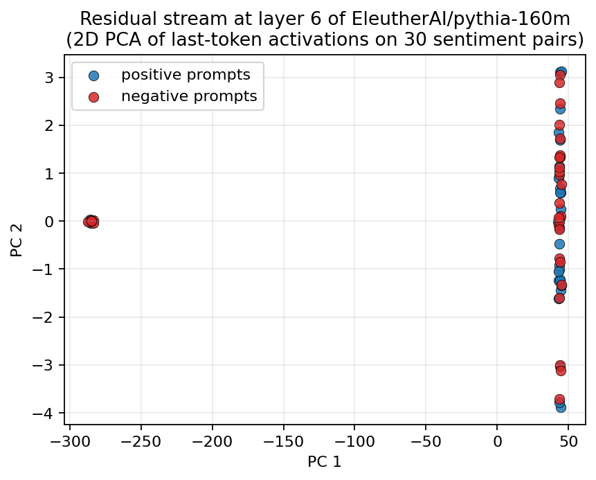
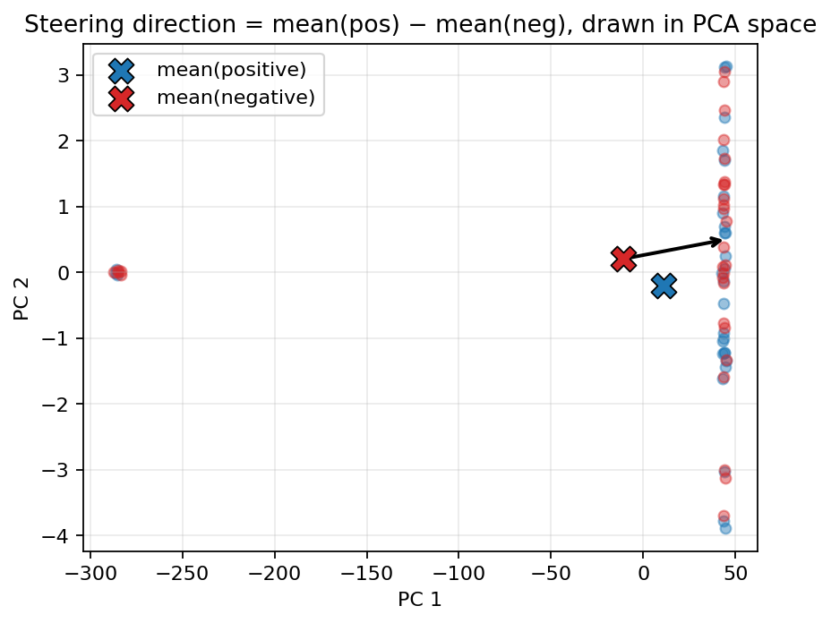
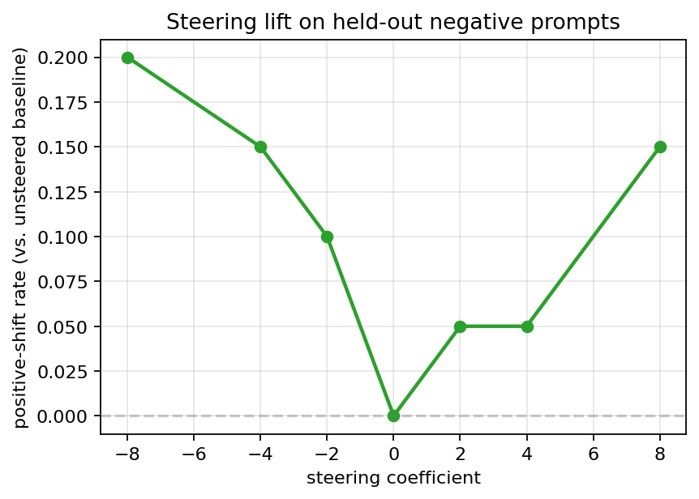
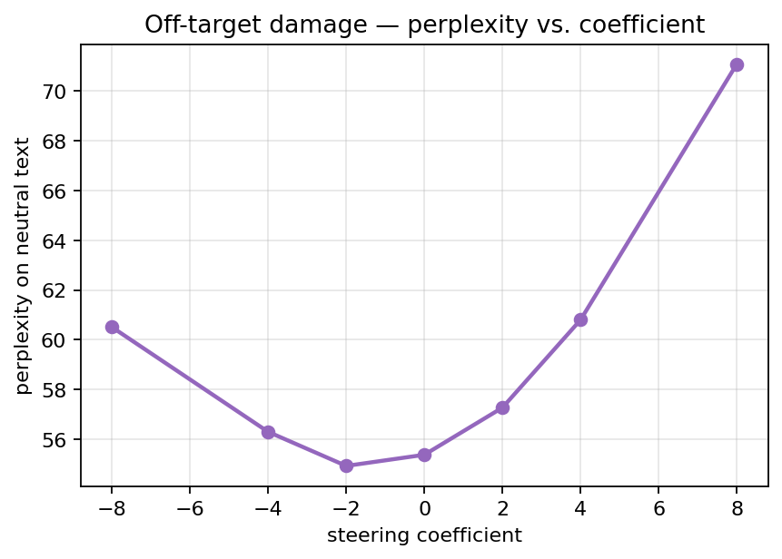

# Chapter 3 — Language models, residual streams, and the simplest steering vector that works

## Why this exists

Two chapters in, we know how to align distributions — both when they share a coordinate frame (Chapter 1, OT) and when they don't (Chapter 2, Gromov–Wasserstein). The rest of the project is about applying that alignment machinery to the internals of language models. Before we can, we need the LLM-side infrastructure: load a model, run prompts through it, grab the right intermediate tensors, build a steering vector, generate text under its influence, and quantify what we got.

This chapter sets all of that up. By the end you should be able to take a fresh model off Hugging Face, extract residual-stream activations on a contrastive prompt pair, build a difference-in-means steering direction, and apply it during generation. We finish by reproducing the basic ActAdd-style sentiment-steering result on GPT-2-small — modest numbers, but the infrastructure is what every later phase will reuse.

## A 3-paragraph crash course on transformers

A *language model* in 2026 is, almost universally, a *Transformer*: a stack of identical processing blocks that takes tokens as input and emits the probability of each possible next token. "Tokens" are the model's vocabulary units — usually sub-word pieces produced by a learned tokenizer. The sequence of tokens is first turned into a sequence of vectors by a lookup table called the *embedding matrix*; each block then refines those vectors and passes them upward.

Each block is built from two big pieces interleaved with a couple of layer-norm operations: *self-attention* (which lets each position look at every other position in the sequence and compute a weighted summary of them) and a *feed-forward network* (an MLP with one hidden layer that processes each position independently). Both pieces are matrix multiplications interleaved with non-linearities; nothing exotic. The block's output has the same shape as its input — a `(batch, seq_len, d_model)` tensor — which is what makes it stackable.

There are 12 blocks in GPT-2-small, 22 in TinyLlama-1.1B, 24 in Qwen2.5-0.5B; the trend over time has been more blocks rather than wider ones. After the last block, a *final layer norm* and an *unembedding matrix* convert the final tensor back into a distribution over vocabulary tokens. That is the entire forward pass. Training fits the embedding, the per-block weights, and the unembedding so that "predict the next token from the preceding ones" is good.

## The residual stream

The standard mech-interp framing — due originally to Anthropic's circuits team — is that each transformer block doesn't *replace* its input; it *adds to it*. Concretely, block $k$ computes some update $\Delta_k$ and outputs `input + $\Delta_k$`. So the same `(batch, seq_len, d_model)` tensor flows from the input embedding all the way to the final layer norm, *accumulating* contributions from every attention head and every MLP along the way. That tensor is called the **residual stream**, and it is the central object of mech-interp.

Why does the residual stream matter for steering? Because it is the only place in the network where *all* the information in flight is mutually compatible — the same coordinate system from layer 0 to layer $L$. The attention outputs and MLP outputs at any given block are *in the same space* as the residual stream of every other block (they have to be — they're added to it). That means a vector we measure inside one block can be added to the residual stream of any other block and the arithmetic is well-defined.

We extract the residual stream by setting `output_hidden_states=True` in the Hugging Face forward pass and indexing into the resulting tuple. `hidden_states[k]` for `k ∈ [0, L]` is the residual stream at the input to block `k`. `src/ot_steering/activations/extractor.py` does this for any of the four model families we support (Pythia, GPT-2, Qwen, Llama). The block-attribute path differs per family — Pythia exposes `gpt_neox.layers`, GPT-2 uses `transformer.h`, Qwen and Llama use `model.layers` — so the extractor's `resolve_blocks` tries each in turn rather than hardcoding one.

## Contrastive activation pairs

A *contrastive activation pair* is what we get when we run two prompts through the same model and tap the residual stream at the same layer. The two prompts are designed to differ along exactly one axis. For sentiment that axis is polarity ("The movie was a stunning achievement" vs. "The movie was a tedious slog"); for refusal it is harm ("How do I pick someone's lock?" vs. "How do I install a smart lock?"); for truthfulness it is correctness ("Water boils at 100 °C" vs. "Water boils at 80 °C"). The other dimensions of the pair — topic, length, sentence shape — are matched as well as we can.

If the axis is well-represented by the model, the activations at some layer will separate into two cleanly distinguishable clouds in residual-stream space. Here is what that looks like for Pythia-160M's layer 6 on 30 sentiment pairs:

A little messier than a textbook example — small models like Pythia-160M don't separate sentiment as cleanly as their larger cousins — but you can see two clouds emerging. On GPT-2-small the same plot would be cleaner; the contrast on TinyLlama or Qwen-0.5B is cleaner still.

## Difference of means — and why the chapter is excited about this

The *steering vector* is the simplest answer to "in which direction does the activation distribution shift when we flip the contrast?": just subtract the two class means.

$$v_{\text{steer}} = \mu_{\text{positive}} - \mu_{\text{negative}} = \tfrac{1}{n}\sum_i x_i^{(+)} - \tfrac{1}{n}\sum_i x_i^{(-)}.$$

Drawn in the PCA plane:

This is the **ActAdd** baseline (Turner et al., 2023) — also called CAA, difference-in-means, or just "the obvious thing." It is the dominant steering vector in the literature, and almost every other technique is benchmarked against it.

**Here's the connection to Chapter 1.** Suppose the positive and negative activation distributions are both Gaussian with the *same covariance* — only their means differ. What is the optimal transport map from one to the other under squared-Euclidean cost? It is a pure translation, equal to $\mu_+ - \mu_-$. The difference-in-means steering vector is exactly the OT-induced map between two unimodal Gaussians with shared covariance. That is the recent CHaRS observation (Abdullaev et al., 2026), and it is the reason why this project is interested in OT for steering at all: every fancier steering map we will build in later phases is a generalisation of this special case to *non-Gaussian* distributions (Phase 4) and to *cross-model* settings (Phase 5–6). The simple thing is a degenerate OT.

To inject the direction at inference time, we attach a `forward_pre_hook` to a chosen transformer block that adds `coefficient * direction` to the block's input (the residual stream at that depth). `src/ot_steering/steering/baselines.py:apply_steering_vector` is that hook. We keep the direction at *unit length* and let `coefficient` carry the magnitude, so the same scale works across layers, models, and dataset sizes.

## The eval harness

Two metrics, both reused in every later phase.

**Steering success rate.** For each held-out negative-class prompt, generate twice — once unsteered, once with `+coefficient * direction` injected at the hook layer. A *positive shift* is when the steered continuation reads as more positive than the baseline under a lexicon-based judge (a hand-curated sentiment word list plus a fallback "neutral" verdict when the count ties). Counting the lift over baseline avoids the "both outputs got pushed to the same place" failure mode of the naive A-vs-B comparison.

**Off-target perplexity.** A steering vector that flips sentiment is not useful if it also corrupts the model's coherence everywhere else. We measure the model's per-token perplexity on a tiny corpus of *neutral* text (chemistry, geology, geography sentences with no sentiment content) *with* the steering vector injected, then sweep the coefficient. Going too far blows up perplexity — the steering vector has a useful range and a destructive range, and the off-target curve shows where the cliff is.

Here are the two curves for Pythia-160M's sentiment direction at layer 6:

The first plot is honest. Pythia-160M is small; the lift exists but it's small (10–20 % positive shifts at moderate coefficients) and somewhat noisy across the sign of the coefficient. The second plot is the more universal pattern: perturbation grows roughly quadratically with coefficient magnitude, and there's a sweet spot at modest coefficients before the perplexity ramp.

On GPT-2-small (`phases/phase_03_llms_and_steering_baselines/experiments/reproduce_sentiment.py`) the same recipe with coefficient `+6.0` on a unit direction gives a **+15 % net lift** in positive-shift rate on the 20-pair eval split. The qualitative generations are striking — negative prompts like "*I'd never go back if I could help it — the food was forgettable*" continue, under steering, with "*I was so happy to be back in the game.*" — even though the conditioning prompt was negative.

## Where this technique works, where it doesn't, and what to read

In practice across the literature:

- **Refusal**, in the sense of "make a safety-trained model decline a request," is the *most robust* steering vector behaviour. Arditi et al. (2024) showed a single residual-stream direction mediates refusal in chat-tuned models — small coefficients move the model cleanly between refuse and comply, and the direction generalises across jailbreak prompts.
- **Sentiment** is the in-between case. The lexicon judge picks up lifts, but the magnitude is sensitive to model scale (larger is much cleaner), layer choice (typically a middle-to-late block), and prompt style.
- **Truthfulness** is the *most fragile*. There seems to be no single "truth direction" for general factual content — the model's representation of "this is true" lives somewhere it does for some types of claim and nowhere for others. Headline numbers on TruthfulQA tend to require either head-level interventions, calibrated prompting, or much fancier steering machinery than the difference-of-means baseline.

The Phase 6 cross-model experiment is therefore most likely to succeed on refusal, possible on sentiment, and least likely on truthfulness. We will measure all three and be honest about what worked.

## What we just learned

- Transformers process a sequence by stacking blocks; each block *adds to* the residual stream rather than replacing it, so the residual stream is the right place to instrument for steering.
- A contrastive activation pair is what we get when we run two carefully-matched prompts through the same model at the same layer; the differences in their residual-stream activations encode the concept axis the pair varies.
- The simplest steering vector — `mean(positive) − mean(negative)` — is the special case of an OT map between two Gaussians with the same covariance. That is the bridge to every fancier method in this project.
- A steering vector has two evaluation dimensions: *does it work* (lift on held-out prompts) and *what does it cost* (off-target perplexity on unrelated text). Both are functions of the coefficient and exhibit a sweet spot.
- The eval pipeline (loader → extractor → direction → hook → judge) is in `src/ot_steering/`; the Phase 3 chapter reproduces a sentiment steering result on GPT-2-small with the same code that Phase 6 will GW-transport across models.

## Go deeper

- *Steering language models with activation engineering* — Turner, Thiergart, et al. (2023). The paper that crystallised the ActAdd / difference-in-means recipe. <https://arxiv.org/abs/2308.10248>
- *A mathematical framework for transformer circuits* — Elhage et al., Anthropic (2021). The original residual-stream framing. <https://transformer-circuits.pub/2021/framework/index.html>
- *Refusal in language models is mediated by a single direction* — Arditi et al. (2024). The cleanest demonstration of a robust, surgically applied steering direction. <https://arxiv.org/abs/2406.11717>
- *Contrastive activation addition* — Rimsky et al. (2024). The contrastive-pair refinement of ActAdd that nudges the technique up the difficulty ladder. <https://arxiv.org/abs/2312.06681>
- *Improving steering vectors by targeting sparse autoencoder features* — Templeton et al., Anthropic (2024). One of the strongest follow-ups; useful context for why difference-in-means is sometimes not enough.

## What's next

Chapter 4 replaces the difference-of-means direction with an *OT-derived steering map* — specifically the CHaRS construction: fit a Gaussian mixture to each class's activations, solve a discrete OT problem between the cluster centres, and use the barycentric projection (the same construction we wrote in Phase 2's `barycentric_project`) to get a *conditional* steering map that depends on the input rather than a single global direction. That is our intra-model upper bound and a sanity check for the OT machinery we will run cross-model in Phase 5.
