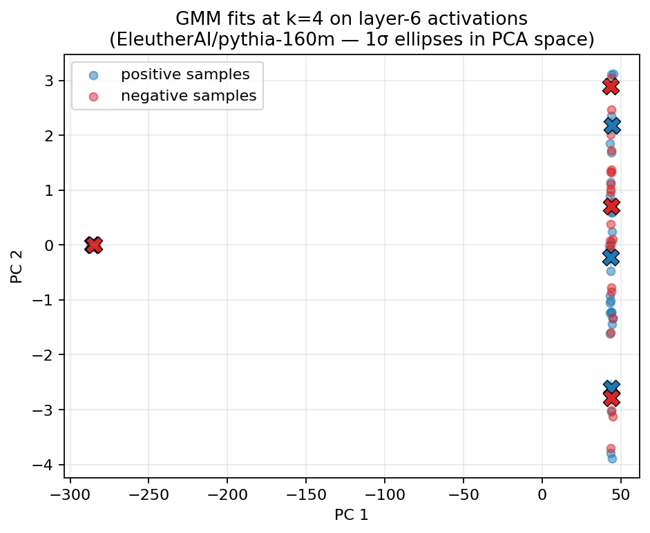
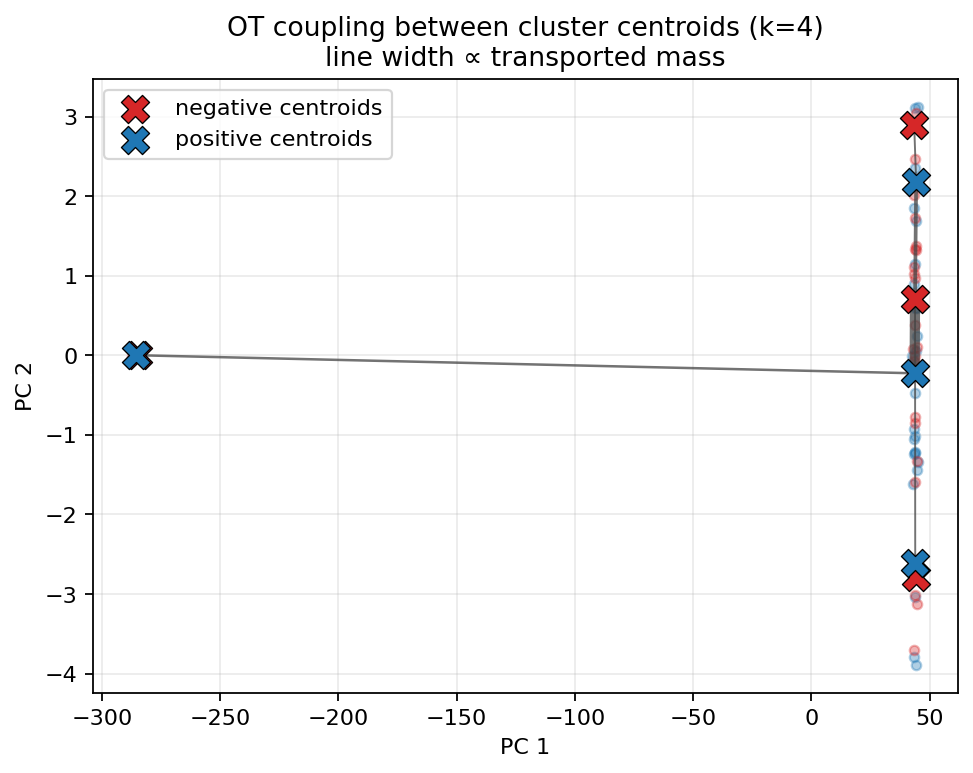
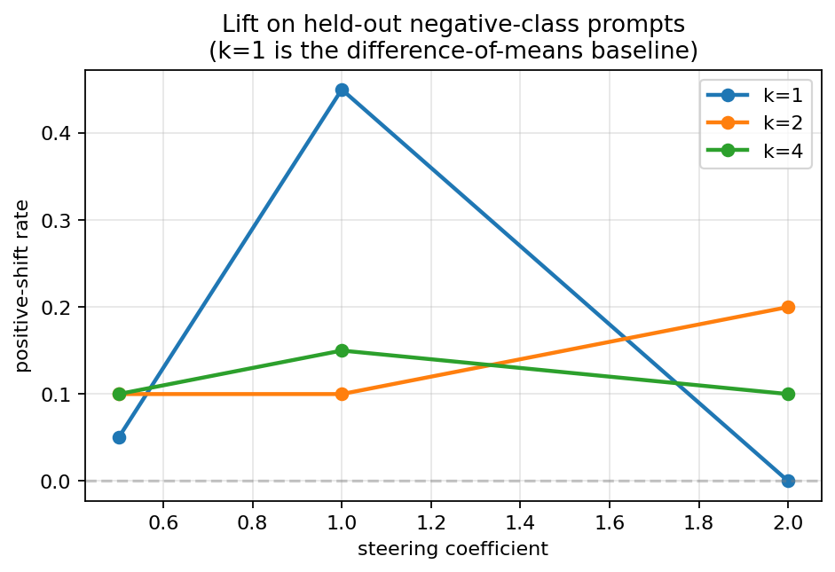
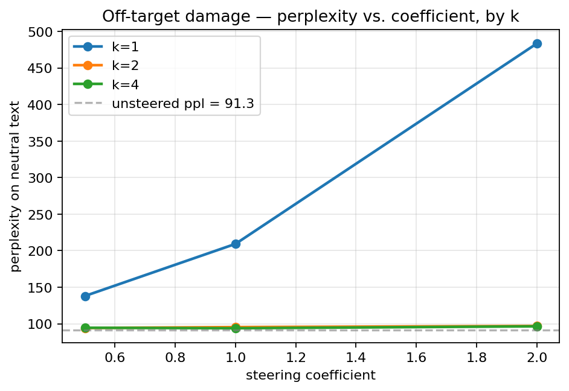

# Chapter 4 — One direction is too few: OT steering with Gaussian mixtures

## Why this exists

Chapter 3 ended on a fact that should bother us. The difference-of-means steering vector — the central object of every steering paper since ActAdd — is the *optimal transport map between two Gaussians with the same covariance*. That is mathematically clean. It is also a very strong assumption.

What if the "harmful prompt" activations don't form a single Gaussian blob? What if they split into three sub-modes — say, *requests for violence*, *requests for deception*, *requests for self-harm* — that the model represents differently? A single direction can only point at the average of those sub-modes; it can't tell us to push activations one way for one sub-mode and a different way for another. Yet that input-conditional behaviour is exactly what a good steering tool ought to have. A query that lives in the "deception" cluster doesn't need to be moved toward the centroid of "violence"-positive prompts to become harmless.

This chapter generalises. We replace each class's activation distribution with a *Gaussian mixture* (`k` components), solve discrete OT between the two sets of cluster centroids using the machinery from Chapter 1, and use barycentric projection (from Chapter 2) to turn the resulting coupling into a *per-cluster displacement map*. At inference, each activation is soft-assigned to source clusters and the per-cluster displacements are blended accordingly. This is the **CHaRS** construction (Abdullaev et al., 2026); we're following their recipe.

The key empirical finding from running it on Pythia-160M's sentiment direction at layer 6: **the OT map is a gentler scalpel**. At matched coefficient, k>1 steering produces noticeably smaller off-target perplexity damage than k=1, sometimes for nearly the same lift. That trade-off is the chapter.

## Worked example you can hold in your head

Picture two clouds of dots in 2D — for now ignore the LLM and just imagine a toy. The *positive* cloud is a sausage-shape stretching from lower-left to upper-right, with two visible humps along its length: a fat one in the lower-left, a thin one in the upper-right. The *negative* cloud has a similar shape mirrored across the y-axis: a fat hump in the lower-right, a thin one in the upper-left.

The difference-of-means steering vector connects the *centroid* of the positive cloud to the *centroid* of the negative cloud. It's a single arrow pointing roughly horizontally. Applying it to any source point pushes it sideways by the same amount.

Now imagine fitting a 2-component GMM to each cloud. The positive cloud's GMM splits into a "lower-left" component and an "upper-right" component. The negative cloud splits the same way along its mirror axis. We can solve OT between the four centroids — it has a natural answer: lower-left-positive ↔ lower-right-negative (the fat-with-fat pair), upper-right-positive ↔ upper-left-negative (the thin-with-thin pair). Each negative cluster now has its own *barycentric image* on the positive side. A query point in the negative lower-right gets pushed to the positive lower-left; a query point in the negative upper-left gets pushed to the positive upper-right.

The total per-cluster displacement vector field looks like two arrows pointing in *different* directions. That is the point: the steering map is now *input-conditional*. The same global "make this positive" instruction is implemented differently depending on where the input sits in source-cluster space.

## The math, briefly (because most of it is already from Chapters 1 and 2)

We fit two Gaussian mixtures, one per class:

$$p^{(\text{pos})}(x) = \sum_{j=1}^{k_+} \pi_j^+ \, \mathcal{N}(x \mid \mu_j^+, \Sigma_j^+), \qquad p^{(\text{neg})}(x) = \sum_{i=1}^{k_-} \pi_i^- \, \mathcal{N}(x \mid \mu_i^-, \Sigma_i^-).$$

`sklearn.mixture.GaussianMixture` does the EM. We use `covariance_type="diag"` by default — full covariance in 768 dimensions with 30 samples is wildly over-parameterised, and the diagonal version is what every CHaRS-style implementation in the literature uses.

The discrete OT problem between the two sets of *centroids* is the same Kantorovich problem from Chapter 1. We use the cluster *weights* $\pi^+, \pi^-$ as the histograms, the squared-Euclidean distance between centroids $\|\mu_i^- - \mu_j^+\|^2$ as the cost matrix, and call `solve_emd` from `src/ot_steering/ot/emd.py`:

$$P \;=\; \arg\min_{P \in U(\pi^-, \pi^+)} \sum_{ij} P_{ij} \, \|\mu_i^- - \mu_j^+\|^2.$$

This gives us a $(k_- \times k_+)$ coupling matrix. We then barycentrically project the *target* centroids through the coupling — the same `barycentric_project` we wrote in Chapter 2 — to get a barycentric target $\hat{\mu}_i^\star$ for each negative cluster $i$:

$$\hat{\mu}_i^\star = \frac{1}{\pi_i^-} \sum_j P_{ij} \, \mu_j^+.$$

The per-cluster displacement vectors are

$$d_i = \hat{\mu}_i^\star - \mu_i^-,$$

and at inference, the displacement for a query activation $x$ is the blend

$$d(x) = \sum_i r_i(x) \, d_i,$$

where $r_i(x)$ are the responsibilities $p(\text{cluster } i \mid x)$ under the *source* GMM. This is the soft assignment. A hard assignment (argmax over clusters) is also a config option.

`src/ot_steering/steering/ot_steering.py` exposes this as `build_ot_steering_map(positive_acts, negative_acts, gmm_cfg=..., emd_cfg=..., assignment="soft")` and a context-manager `add_ot_steering_hook(block, steering_map, coefficient)` that mirrors the API of the difference-of-means hook from Chapter 3. **At k = 1 the construction reduces to difference-of-means exactly** (we test for this, agreement within ~1e-7).

## A picture of the fit

Here are the per-class GMM fits with k = 4 on Pythia-160M's layer-6 sentiment activations:

Two things to notice. First, the per-class clusters overlap considerably in 2-D PCA — small models like Pythia-160M don't separate sentiment as cleanly as larger ones, and we're looking at only 2 components of a 768-dim space. Second, the 1σ ellipses are stretched (anisotropic): the diagonal covariance captures that the activations vary much more along some PCA directions than others.

The OT coupling between the four positive centroids and the four negative centroids is sparse — most pairs carry no mass — and concentrated on the geometrically natural pairings:

## Does it work? The trade-off plot

Now the empirical question. Run the same eval as Chapter 3 — generate baseline (unsteered) and steered continuations on a held-out set of negative prompts, count how many shifted positive — but vary `k` along with the coefficient.

On raw lift, **k = 1 wins.** At coefficient 1.0, Pythia-160M's k=1 steering produces a 45 % positive-shift rate, while k=2 and k=4 hover in the 10–15 % range. If your only metric is "how often did the output flip toward positive," difference-of-means is the right tool.

But raw lift is half the story. The off-target curve makes it clear what the cost is:

The dashed grey line is the baseline (unsteered) perplexity on a small corpus of neutral sentences — chemistry, geology, etc. At coefficient 0.5, k=1 raises that perplexity from 91 to ~138; at coefficient 2.0, k=1 sends it to 483 (five times baseline, i.e. the model has been blasted into incoherence on text that has nothing to do with sentiment). The k=2 and k=4 curves are far flatter — perplexity stays within a couple of points of baseline across the entire coefficient sweep.

**That is the CHaRS argument in one chart.** The OT map is a *gentler* steering instrument: the per-cluster displacements only fire when an activation looks like a member of that source cluster, so query activations that are *not* in the sentiment-relevant part of activation space are barely perturbed. The single ActAdd direction has no such locality — it adds the same vector to every token at every depth, including all the tokens about carbon and the Mariana Trench. The off-target neutrals pay for that bluntness.

A cell-by-cell sweep across {GPT-2, Pythia} × {sentiment, refusal} is in `phases/phase_04_intra_model_ot_steering/experiments/compare_baselines.py` and writes the full grid as JSON to `outputs/<run_id>/compare_baselines.json`. Two cautions about that sweep:

- **GPT-2-small's refusal cell is structurally meaningless.** Base GPT-2 is not chat-tuned and does not refuse anything; the refusal direction has nothing to extract. A proper refusal eval needs a model with safety training (TinyLlama-1.1B-Chat-v1.0 is the obvious 4-bit candidate within our VRAM budget; we will lean on it in Phase 6).
- **30 training pairs is generous for k=1, tight for k=4, scary for k=8.** With d_model = 768 and 30 samples per class, the k=8 GMM is borderline degenerate even with diagonal covariance. The comparison experiment with k=8 is included for completeness; the chapter's headline figures stop at k=4.

## What we just learned

- A single steering *direction* implicitly assumes the activations from each class form a single Gaussian blob. That assumption fails as soon as a class has sub-modes (refusal-by-type, sentiment-by-genre, …).
- Fitting a Gaussian mixture per class and solving discrete OT between the centroids gives a coupling. Barycentric-projecting the target centroids through that coupling yields a per-cluster displacement vector field — input-conditional steering.
- At k = 1 the construction is exactly the difference-of-means baseline. At k > 1 it adds locality: each activation is steered along the direction that matters for *its* part of activation space.
- Empirically on Pythia-160M sentiment, the trade-off shows up cleanly: k > 1 dramatically reduces off-target perplexity at matched coefficient, at the cost of smaller raw lifts. CHaRS is a scalpel, not a sledgehammer.
- The OT/barycentric machinery used here is the same code from Chapters 1 and 2 — `solve_emd` and `barycentric_project`. The novelty is the *recipe* that combines them, not the solvers.

## Go deeper

- **CHaRS** — Abdullaev et al. (2026), *Concept-conditional Steering via Optimal Transport*. The paper this chapter follows. The intuition above and the GMM-OT-barycentric pipeline are theirs; we wrap their construction in our infrastructure.
- **GMMs** — Bishop, *Pattern Recognition and Machine Learning*, chapter 9. The EM derivation is the cleanest written explanation; everything ML uses GMMs the same way.
- **Wasserstein barycentres** — Cuturi & Doucet (2014), *Fast Computation of Wasserstein Barycenters*. The right reference if you want to think of `barycentric_targets` as a Wasserstein barycentre of the target centroids weighted by the coupling rows.
- **Steering with SAE features** — Templeton et al. (2024), *Scaling Monosemanticity*. An alternative steering paradigm that uses sparse-autoencoder features rather than dense directions. Useful contrast.
- **ActAdd revisited** — Stolfo et al. (2024), *Improving Activation Steering in Language Models with Mean-Centring*. The mean-centring baseline we wrap in Phase 3, explained at length.

## What's next

Chapter 5 takes the same OT machinery cross-model. We compute intra-distance matrices of contrastive activations on two different LLMs and run Gromov–Wasserstein (Chapter 2) between them. The point isn't to steer yet — that's Chapter 6 — but to verify that GW does something sensible: identity on self-pairs, near-identity on adjacent layers, high cost on unrelated random distributions. If those sanity checks pass, we have evidence that the *relational structure* of contrastive activation distributions is model-agnostic enough to support cross-LLM steering transport.
