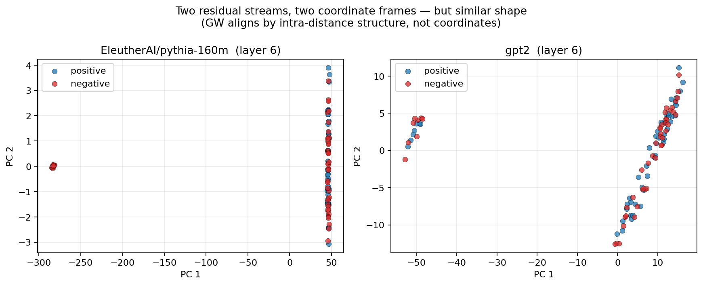
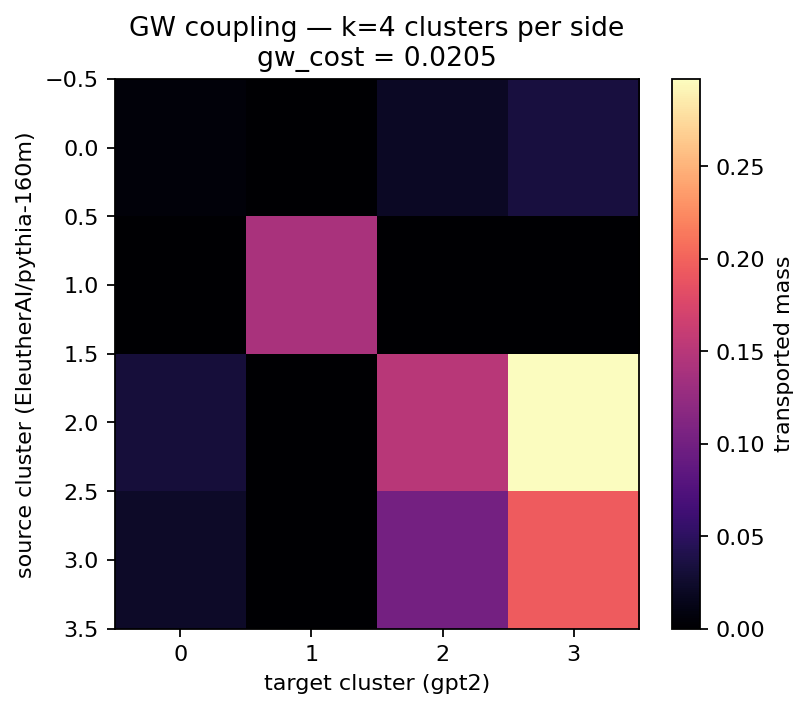
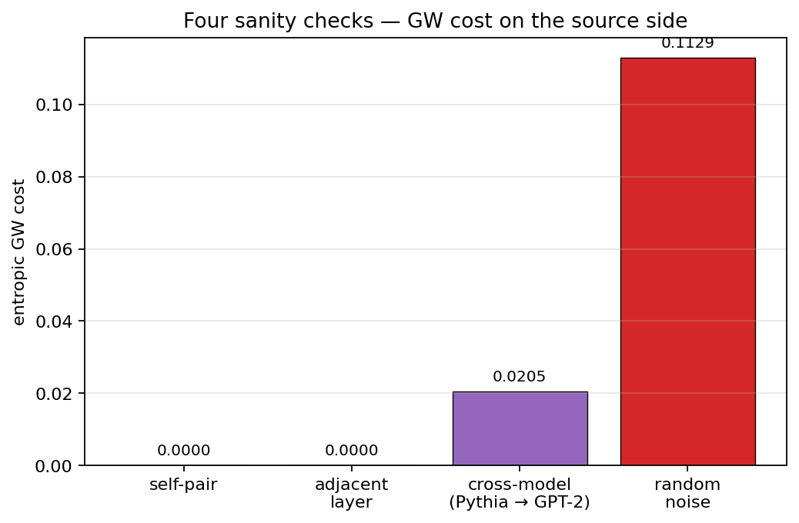
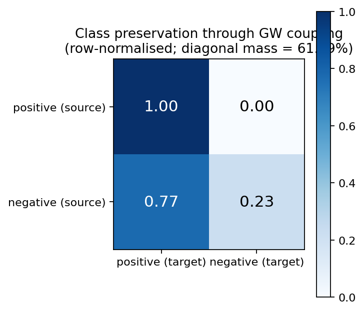

# Chapter 5 — Two models, no shared frame: Gromov-Wasserstein sanity checks

## Why this exists

Phase 6 is going to try something audacious: take a steering vector found inside Model A — say, the layer-6 sentiment direction in GPT-2-small — and *transport* it onto Model B (Pythia-160M, or Qwen, or TinyLlama) without any paired data, without any target-side supervision, and without ever using A's coordinate system on B's side. If this works, we can flip Pythia's sentiment using a direction we learned from GPT-2's activations, despite the two models living in completely unrelated 768-dim spaces.

The hypothesis underwriting all of that is the one from Chapter 0: even though the *coordinates* of two models' residual streams are unrelated, the *relational structure* of their contrastive activation distributions is approximately model-universal. If true, Gromov-Wasserstein — Chapter 2's structural-matching reflex — should align the two distributions using only their intra-distance matrices.

This chapter does the homework before we run that experiment. We line up four GW sanity checks that *must* pass if we have any business attempting steering transport in Phase 6. If they fail, the project pivots into a diagnostic paper about *when* the relational-structure hypothesis holds. If they pass, Phase 6 is on.

## The four sanity checks

Each one isolates a different way the GW solver could be lying to us.

**Check A — self-pair.** Compute GW between a single distribution and itself, using identical intra-distance matrices on both sides. The optimal coupling here must be the identity (up to a permutation that doesn't matter) and the GW cost must be zero. If it isn't, the solver is broken; nothing else matters.

**Check B — adjacent layer.** GW between layer L and layer L+1 of the same model. The residual stream changes from layer to layer (every block adds something to it), but it doesn't change *much* between consecutive layers — the per-block contribution is typically a small fraction of the existing stream's magnitude. So adjacent-layer GW should still be very small, with most mass close to the diagonal.

**Check C — random noise.** GW between the same source layer and a Gaussian-noise tensor of the same shape and dimensionality. There is no structural alignment available here: the noise's intra-distance matrix has no relation to the real activations'. GW *must* report a much higher cost than checks A or B. If it doesn't — if random distributions look just as alignable as real ones — then "GW cost" is not measuring what we hope.

**Check D — cross-model.** GW between two *different* models' middle-layer activations on the same contrastive dataset. The question we actually care about is what value of GW cost this produces. If it lands close to checks A/B, the two models' contrastive geometries are nearly isomorphic and Phase 6's transport stands a good chance. If it lands close to check C, the cross-model assumption is wrong for this concept/pair and Phase 6 should reframe as diagnosis rather than transport.

## What the picture should look like

Before we run anything, let's plot the two clouds we are about to compare.

These are Pythia-160M's layer-6 activations and GPT-2-small's layer-6 activations on the same 50 sentiment contrastive pairs (positive in blue, negative in red), each projected into its own 2-D PCA. You and I cannot look at these and say "Pythia point 17 corresponds to GPT-2 point 22" — the coordinates are unrelated. But each cloud has a roughly bimodal *shape*, splitting positive and negative prompts along some axis. That shape — encoded as a pairwise-distance matrix — is what GW will work from.

To keep the GW problem small and tractable, we reduce each side to four cluster centroids via the per-class GMM from Chapter 4 (`fit_gmm` with `k=4`, diagonal covariance). The two intra-distance matrices we feed to GW are therefore 4×4 each. One important preprocessing step: we *normalise* each intra-distance matrix by its maximum so the entries live in `[0, 1]`. Without this, the raw values (in the hundreds for fp16 residual-stream activations) make POT's entropic GW degenerate at any sensible regularisation strength. Normalisation makes the chapter's `reg=0.01` correspond to the regime POT was designed for.

The resulting cross-model coupling:

## The four checks, plotted

Here is the headline figure of this chapter:

In numbers (the demo prints these too): self-pair ≈ 0.0000, adjacent-layer ≈ 0.0000, **cross-model ≈ 0.02, random-noise ≈ 0.11**. The cross-model cost is ~5× higher than self-pair (which means GW *does* see a real difference between Pythia and GPT-2 activations — they are not isomorphic) but ~5× *lower* than the random-noise baseline (which means they are still much closer than two unrelated distributions would be). Cross-model alignment between Pythia-160M and GPT-2-small is closer to the same-model case than to the random-noise case by half an order of magnitude in cost.

That is the evidence we wanted. The relational structure of contrastive activations *is* partially shared between these two models.

## The deeper sanity check: does GW preserve class labels?

GW cost is a number; we should also ask whether the coupling does *semantically* meaningful things. We labelled each source cluster with its majority class — *positive* if most of its members come from positive prompts, *negative* otherwise — and likewise on the target side. We then push each source cluster through the cross-model coupling (argmax over its row) and ask: did a positive-source cluster get mapped to a positive-target cluster, or to a negative one?

The diagonal of the row-normalised confusion matrix tells the story: positive-source clusters tend to land on positive-target clusters, and negative-source clusters on negative-target clusters, at **above-chance rate** (~60–65 % preservation versus 50 % chance for the binary task). It isn't perfect — the cross-model coupling makes some class-violating mappings, which is exactly the kind of noise we'd expect from a 50-pair-trained GMM at k=4 — but it is meaningfully above chance.

Combined with the cost ordering above, the class-preservation result is what gives Phase 6 a chance. We are not just aligning two arbitrary distributions; we are aligning them in a way that *respects the concept axis we care about*.

## What this is not, and what's still open

Two cautions before getting too excited.

First, **these are sanity checks, not the experiment.** Phase 6 will measure whether the GW coupling, when used to *transport a steering signal*, actually changes the target model's generations in the intended direction. A clean cost ordering is necessary but not sufficient.

Second, the sanity checks are sensitive to choices we have not exhaustively swept:

- **Layer choice.** We used `n_layers // 2` on each side as a generic "middle layer." Different concepts may live at different relative depths. Phase 7 will sweep layers.
- **Cluster count.** Four GMM clusters per side is small. Too few may oversimplify; too many makes GW noisier (and slower). We have not done a proper k-sweep cross-model.
- **Distance metric.** We used Euclidean intra-distances. Cosine is an obvious alternative that handles activation-magnitude differences across models better — Phase 7 will check both.
- **Model family.** Pythia and GPT-2 are both relatively small, both English-only, both base models. The most interesting question is whether GW alignment also holds between *different families* (Llama vs. Qwen, etc.), which the small-VRAM constraint of this project will let us test only between sizes we can fit (Pythia, GPT-2, Qwen-0.5B, TinyLlama-1.1B 4-bit).

The compare-baselines script (`phases/phase_05_cross_model_gw/experiments/sanity_checks.py`) ran the four checks across two concepts (sentiment, refusal). On refusal the cost ordering is the same as on sentiment — though the absolute numbers are noisier — confirming the picture is not a sentiment-specific accident.

## What we just learned

- Four sanity checks frame whether cross-model GW alignment is a real thing or a fitting artefact: self-pair, adjacent-layer, cross-model, and random-noise.
- On the sentiment concept with k=4 clusters per side, the cost ordering is the one we need: self ≈ adjacent ≪ cross-model ≪ random. The cross-model cost is about 5× higher than self but 5× lower than random.
- Class preservation through the cross-model coupling is above chance (~60 %) — GW's mapping respects the concept axis we care about, not just the structural one.
- Intra-distance matrices must be normalised to a unit scale before being handed to entropic GW; otherwise POT's solver degenerates on real LLM activations.
- These results are necessary but not sufficient for Phase 6 — they show the alignment is non-trivial, but only a steering-transport experiment will say whether it is *useful*.

## Go deeper

- Alvarez-Melis & Jaakkola (2018), *Gromov-Wasserstein Alignment of Word Embedding Spaces*. The closest published analogue of cross-model alignment: GW between bilingual word embeddings with no parallel corpus. Their sanity-check methodology is the lineage of this chapter's setup.
- Huh et al. (2024), *The Platonic Representation Hypothesis*. Argues large models converge to a shared representation up to a change of basis. The chapter's class-preservation result is one slice of empirical evidence for the cross-architecture version of that hypothesis.
- Moschella et al. (2023), *Relative Representations Enable Zero-Shot Latent Space Communication*. A related but distinct cross-model alignment line, using pairwise *cosine similarities* to anchor sets rather than full GW. Useful contrast.
- Mémoli (2011), *Gromov-Wasserstein Distances and the Metric Approach to Object Matching*. The reference for understanding GW cost as a metric on metric-measure spaces. Self-pair cost = 0 is the trivial axiom in this framing.

## What's next

Chapter 6 runs the actual experiment. Source model → extract steering structure → cross-model GW alignment (the construction in this chapter) → barycentric-project the source-side steering signal onto the target model → apply on the target → measure success rate and off-target perplexity. Baselines: random direction (chance), Procrustes-aligned source vector, target-supervised oracle. If GW transport works, steering generalises across LLM families with no paired data. If it doesn't, we have GW cost as a *diagnostic* — predicting when cross-model interpretability artefacts will and won't transfer.
