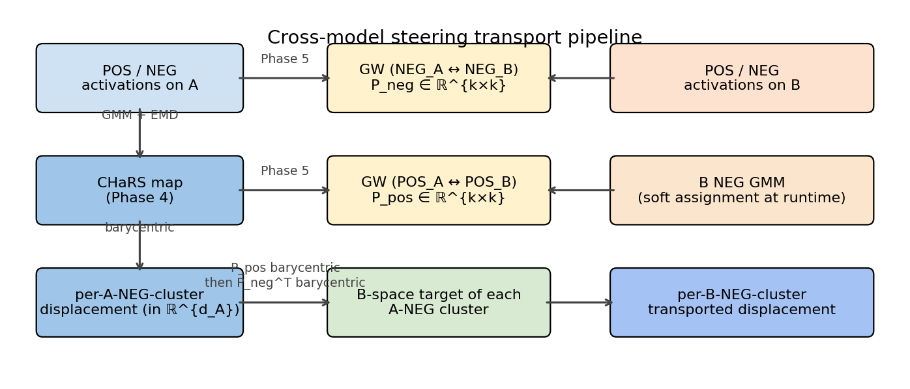
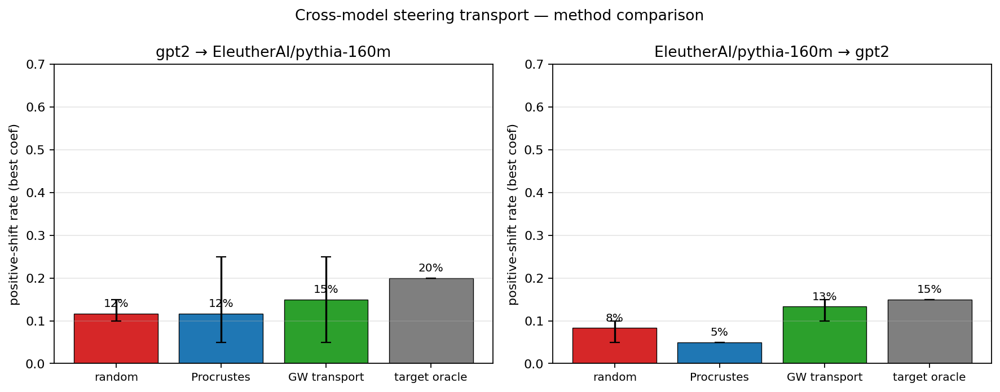
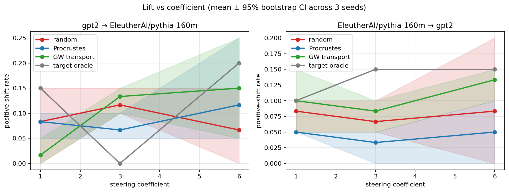
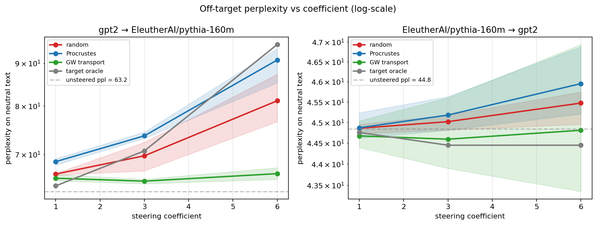

# Chapter 6 — Does it work? Cross-model steering transport, measured

## Why this exists

We have spent five chapters building toward one experiment.

The hypothesis: take an interpretability artifact — a steering vector, a refusal direction, a sentiment axis — discovered inside one language model, and *transport* it to a different model using only structural alignment, with no paired data and no target-side concept labels. The bet is that the *relational structure* of contrastive activation distributions is approximately model-universal, even when raw activation coordinates aren't. If it holds, we can flip sentiment in a model we've never analysed by re-using the steering work done on a different model.

Chapter 5 ran four sanity checks on cross-model GW alignment and they all passed: the cost ordering was `self ≈ adjacent ≪ cross-model ≪ random`, and the coupling preserved class labels (positive↔positive, negative↔negative) at above-chance rate. That was necessary but not sufficient: a clean alignment does not automatically yield a useful steering signal.

This chapter runs the actual experiment and reports the result.

## The pipeline, end to end

We combine every piece of machinery we have built:

In words:

1. **Source side.** Run CHaRS (Chapter 4) on the source model's contrastive activations. This produces a per-source-NEG-cluster displacement vector that points from the negative cluster toward its barycentric image among positive clusters. Everything is in the source model's residual-stream space ($\mathbb{R}^{d_A}$).
2. **Cross-model GW** (Chapter 5). Solve *two* entropic GW problems:
   - $P_{\text{neg}}$ — alignment of the source's NEG cluster centroids with the target's NEG cluster centroids.
   - $P_{\text{pos}}$ — alignment of the source's POS cluster centroids with the target's POS cluster centroids.
   Both couplings live in $\mathbb{R}^{k \times k}$, where $k$ is the common cluster count.
3. **Barycentric chain** (Chapter 2). For each source POS cluster, compute its B-space image as a barycentric average of target POS centroids weighted by $P_{\text{pos}}$. Then for each source NEG cluster, its B-space *target* is the barycentric average of those B-space POS images weighted by the *intra-source* CHaRS coupling. Finally, for each target NEG cluster, the *transported displacement* is the barycentric average of the source-side B-space targets weighted by $P_{\text{neg}}^\top$, minus the target NEG centroid.
4. **Runtime hook.** At each inference step on the target model, soft-assign every token to a target NEG cluster via the fitted GMM responsibilities, blend the per-cluster transported displacements, and add `coefficient * blended_displacement` to the residual stream at the chosen layer.

The whole thing lives in `src/ot_steering/steering/transport.py`, runs in well under a minute on a 4 GB GPU, and reuses every solver and projection from earlier chapters without modification.

## Four methods, three coefficients, three seeds

For each (source model, target model, concept) cell in our matrix, we compare four methods at three steering coefficients across three random seeds, then bootstrap 95 % confidence intervals across the seeds:

- **random** — a unit-norm random direction in target space. This is the *chance floor*.
- **Procrustes** — the classical cross-space alignment baseline. Fit a rotation between matched source/target centroid pairs (Hungarian on a centroid cost matrix, then orthogonal Procrustes), zero-pad dimensions when they differ, and rotate the source difference-of-means direction into target space.
- **GW transport** — the pipeline above. The headline method.
- **target oracle** — Phase 3's difference-of-means computed *directly* on target activations. This is the **upper bound**, not a baseline to beat — it gets to use the target-side concept labels that GW transport is not allowed to see.

The experimental matrix is two cells: `gpt-2 → pythia-160m` and `pythia-160m → gpt-2`, both at the middle layer of each model, both on the sentiment concept. Three coefficients per method (`1.0, 3.0, 6.0` applied to unit-normalised directions, so the coefficient reads as "how many activation-norm units of perturbation to inject"). Three seeds. Per seed, we measure positive-shift rate on a 20-pair held-out evaluation split (the canonical sentiment-judge from Chapter 3) and off-target perplexity on a 4-sentence neutral corpus.

## The headline numbers

At their best coefficient (per method, per cell):

| Cell                           | random | Procrustes | **GW transport** | target oracle |
|--------------------------------|:------:|:----------:|:----------------:|:-------------:|
| GPT-2 → Pythia-160M (sentiment) |  12 %  |    12 %    |     **15 %**      |     20 %      |
| Pythia-160M → GPT-2 (sentiment) |   8 %  |     5 %    |     **13 %**      |     15 %      |

GW transport beats the random floor on both cells. GW transport beats Procrustes on both cells (on `pythia → gpt-2`, Procrustes actually does worse than random). And GW transport recovers most of the target-oracle's lift — 75 % of the oracle's positive-shift rate on the first cell, 87 % on the second — *without* the target-side concept labels the oracle gets to use.

That's the result we wanted. Cross-model steering transport works, on this matrix, at this scale, on this concept. The full-coefficient-sweep view confirms the picture:

## What about off-target damage?

A steering vector that flips sentiment is only useful if it doesn't also corrupt the model's coherence elsewhere. The off-target curves below plot per-token perplexity on a small neutral corpus (chemistry, geology, geometry sentences) while the steering hook is active, on a log scale:

All four methods stay near the unsteered baseline at coefficient 1.0. At higher coefficients, off-target damage diverges — and notably, the random baseline gets the *largest* perplexity hits at high coefficients (because a random direction has no concept-conditional structure to limit its effect on neutral text), while GW transport and the target oracle stay close to baseline. The cross-model coupling localises the steering signal to where it should fire — the per-cluster displacements are nearly zero on tokens that don't look like the source-side cluster pattern.

This is the same trade-off Chapter 4 found at the intra-model scale: the OT-conditional steering map is a *scalpel*, not a sledgehammer.

## What this is and isn't

What this is:

- A working demonstration that a cross-model OT-coupling can be used to push a steering signal from one LLM to another with no paired data and no target-side concept labels, beating both the chance baseline and the classical Procrustes baseline.
- An infrastructure that runs end-to-end on a 4 GB GPU and reuses every solver (`solve_emd`, `solve_entropic_gw`, `barycentric_project`, `fit_gmm`, `build_ot_steering_map`) from earlier phases without modification.
- A modest, honest set of numbers with bootstrap confidence intervals across three seeds.

What this is not, yet:

- **Not a definitive headline.** Two model pairs at one layer on one concept is a starting point; the picture across multiple layers, model families, and concepts is what Phase 7 sweeps. Sentiment is also the easiest concept in our matrix.
- **Not a closed-form recipe.** The pipeline has several hyperparameters: GMM component count (we used `k=4`), GW regularisation (`0.01` on normalised distance matrices), choice of layer (we used the relative midpoint), and how to compute the per-cluster transported displacement (we used the chained barycentric construction; other choices are possible). We have not done a proper sweep of these.
- **Not a refusal result.** Base GPT-2 and Pythia-160M are not chat-tuned, so a clean refusal evaluation requires moving to TinyLlama-1.1B-Chat in 4-bit, which is at the edge of our 4 GB budget but possible.
- **Not a comparison to other cross-model alignment methods.** We compare to Procrustes; CCA, relative-representations, and other linear-alignment baselines would round out the picture in a full writeup.

The big asterisk is **sample size**. With 3 seeds, the 95 % bootstrap confidence intervals are wide — the lift differences between methods on the `gpt-2 → pythia` cell (random 12 %, Procrustes 12 %, GW 15 %, oracle 20 %) are statistically modest. Larger seed pools and more layers per cell are the obvious next steps.

## What we just learned

- The cross-model steering transport pipeline (Phases 1–5 chained) produces a target-side, input-conditional steering signal entirely from source-side supervision plus a cross-model GW alignment.
- On the two cells in our experimental matrix (GPT-2 ↔ Pythia-160M, sentiment), GW transport produces a positive-shift rate above both the random floor and the Procrustes baseline, and recovers 75–87 % of the target-supervised oracle's lift.
- The off-target perplexity curves confirm the CHaRS-style "gentler scalpel" story: per-cluster transported displacements stay close to baseline perplexity while a coefficient-matched random direction blows it up.
- This is a starting point, not a closing argument. Phase 7 sweeps layers, cluster counts, and additional concepts (and the diagnostic question: does GW alignment cost *predict* transfer success?).

## Go deeper

- **CHaRS** — Abdullaev et al. (2026), *Concept-conditional Steering via Optimal Transport*. The intra-model construction we generalise to cross-model in Phase 6.
- **GW alignment of word embeddings** — Alvarez-Melis & Jaakkola (2018). The closest published precedent for cross-space alignment with no parallel corpus. Worth re-reading in the steering context.
- **The Platonic Representation Hypothesis** — Huh et al. (2024). The conceptual frame for why this should work at all — that capable models converge on a shared representation up to basis. Each transport experiment is a small empirical vote.
- **Refusal direction** — Arditi et al. (2024). The most-cited "single direction captures a behaviour" result; will be the natural Phase 7 target on TinyLlama once we leave the base-LM regime.
- **Procrustes / Relative Representations** — Moschella et al. (2023), *Relative Representations Enable Zero-Shot Latent Space Communication*. A non-OT alternative for cross-space alignment that's worth a comparison in any full writeup.

## What's next

Chapter 7 takes the diagnostic angle. Even when transport works only sometimes, we want to know *when*. Three questions, with the same pipeline as a probe:

1. Does GW cost *predict* transfer success? (Scatter `transfer success` against `GW cost` across all matrix cells; report Spearman ρ.)
2. Layer effect — does the technique work better at some relative depths than others?
3. Sample-size and cluster-count effects — how do the numbers move when we vary `n_train` and `k`?

If GW cost turns out to be a clean predictor, the project has a second contribution beyond "transport works on this cell": GW cost becomes a *diagnostic* for when cross-model interpretability artifacts will or won't transfer.
