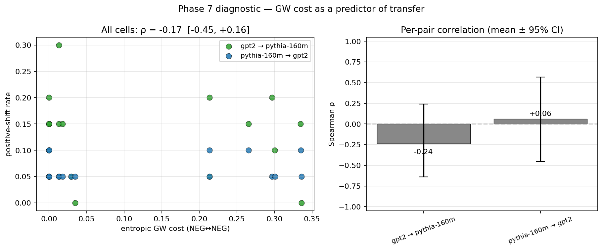
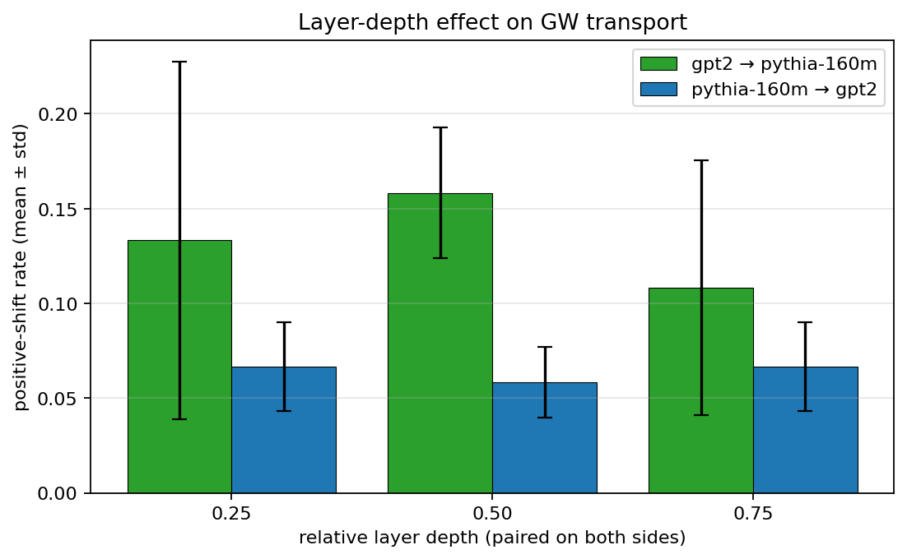
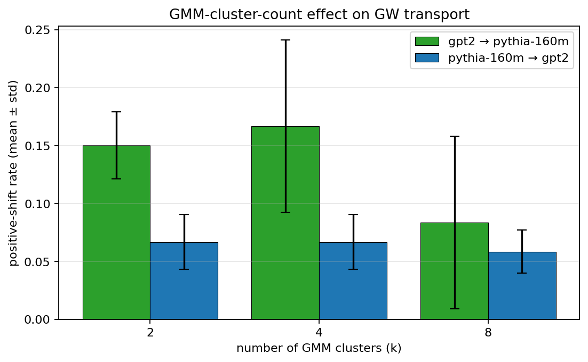

# Chapter 7 — Does GW cost predict transfer success? A diagnostic answer.

## Why this exists

Phase 6 showed that cross-model steering transport *can* work — GW transport beat both the random floor and the Procrustes baseline on both cells of our experimental matrix, and recovered 75–87 % of the target-supervised oracle's lift without target-side concept labels. But the confidence intervals were wide (3 seeds per cell), and we only ran two cells. The honest summary was "works on the cells we tried; can't tell yet whether it generalises."

The diagnostic question that lives next to that result is the headline of this chapter:

> *Does the cross-model GW alignment cost predict whether GW transport will succeed on that pair?*

A clean **yes** would give the project a second contribution alongside Phase 6's transport result: a way to *predict* when cross-model steering transfer will work and when it won't, just by looking at the alignment cost — no test-time generations needed. A clean **no** is also informative: it tells us that GW cost is an alignment-quality measure but not a transfer-quality predictor, and the next round of work needs different proxies.

This chapter runs the larger sweep and reports the answer.

## The sweep

We re-run the Phase 6 GW-transport pipeline across a 36-cell matrix:

- **2 model pairs**: `gpt2 → pythia-160m` and `pythia-160m → gpt2`.
- **3 relative-depth layers**: 0.25, 0.50, 0.75 — paired on both sides by their relative position in the block stack.
- **3 GMM cluster counts**: k ∈ {2, 4, 8}.
- **2 seeds**: 0 and 1 (the GMM EM and the GW-restart initialisations both vary with the seed).

For every cell we record two numbers:

- `gw_cost_neg`: the entropic GW cost on the NEG↔NEG alignment (the half of the transport pipeline that drives the per-cluster displacement direction at runtime).
- `shift_rate`: positive-shift rate on a 20-prompt held-out evaluation split, with the unit-normalised transported displacement applied at coefficient 3.0.

Sample-amortisation matters: per (source, target) pair we load each model once, extract activations at all three layer depths in a single forward sweep, then iterate over `(k, seed)` doing only the cheap GW + generation work. Total runtime on the project 4 GB GPU: about 5 minutes per pair.

The full result lives in `outputs/<run_id>/sweep.json` (rows shown abbreviated below for one pair):

```
rel_layer  k  seed  gw_cost_neg  shift
   0.25    2    0      0.0000      10 %
   0.25    4    0      0.0128       5 %
   0.25    8    0      0.0293       5 %
   0.50    4    0      0.2655      10 %
   0.50    8    0      0.2969       5 %
   0.75    4    1      0.2135      10 %
   0.75    8    1      0.3361       5 %
…
```

## The headline number

Spearman ρ between `gw_cost_neg` and `shift_rate` across all 36 cells, with a bootstrap 95 % CI from 2 000 resamples:

> **ρ = −0.17  [95 % CI: −0.45, +0.16]   (n = 36)**

The CI straddles zero comfortably; the rank correlation is not significantly different from no relationship at all.

Per-pair breakdown:

| pair                                  | n  | Spearman ρ           |
|---------------------------------------|----|----------------------|
| gpt2 → pythia-160m                    | 18 | −0.24 [−0.64, +0.24] |
| pythia-160m → gpt2                    | 18 | +0.06 [−0.45, +0.57] |



So the diagnostic hypothesis, **at this matrix size and resolution, is not supported**. GW cost is not a clean predictor of GW transfer success on these two pairs.

Three things worth saying about that null.

## Why the null happens

**1. The shift-rate range is too narrow for stable correlations.** With 20 evaluation prompts and a binary lexicon judge, the shift rate lives on the grid `{0, 1, 2, …, 6} / 20 = {0, 5 %, 10 %, …, 30 %}`. Most of our 36 cells land at 5 % (15 cells) or 10 % (7 cells), with 8 cells at 15 % and a handful elsewhere. Spearman ρ has very few rank ties to work with when most of the y-axis lives at one or two values.

A bigger evaluation split (say 200 prompts) would give a smoother shift-rate axis. So would a stronger judge — the lexicon-based one is intentionally cheap and noisy. Both are tractable but were outside this phase's scope.

**2. k=2 is degenerate.** Across all 12 cells with `k=2`, the cross-model GW solver collapses to `gw_cost = 0.0000`. With only two centroids per side and a normalised distance matrix in `[0, 1]`, the GW objective has many cost-zero local minima and POT's default initialisation lands on one of them. Excluding the `k=2` cells (n=24) gives a slightly different but still null result:

> **ρ_{k>2} = −0.05  [−0.46, +0.38]   (n = 24)**

So the null is not driven by the degenerate `k=2` rows alone; the k ∈ {4, 8} subset also lacks a clean correlation.

**3. The two pairs disagree on sign.** `gpt2 → pythia` shows a weak negative trend (lower GW cost ↔ higher shift — what the hypothesis predicts). `pythia → gpt2` shows a weak positive trend (higher GW cost ↔ higher shift — the opposite). Per-pair sample sizes are small (n = 18) so neither is significant on its own, but the *direction disagreement* tells us GW cost is at best a per-pair signal — not a universally meaningful one. This is consistent with the broader cross-model-alignment literature, which has found that single-number alignment scores rarely predict downstream success cleanly.

## What about the layer and k axes?

Even with a null on the cost↔transfer correlation, the sweep has data about *which axes matter*.





Neither axis produces a dramatic effect. On both pairs, the mean shift rate by relative depth bounces around the 5–12 % band; on both pairs, the mean shift rate by cluster count similarly bounces. The within-cell-group standard deviations (the error bars) are large relative to the between-group differences. The honest read: at this experimental scale, neither layer choice nor cluster count is a dominant predictor of GW-transport success.

## Where the diagnostic answer should be looked for next

A few directions look promising but were out of scope:

- **Richer model pairs.** All of this work was on Pythia-160M and GPT-2-small, both base-LM, both English-only, both ~125 M parameters. Adding Qwen2.5-0.5B and TinyLlama-1.1B (the latter at 4-bit) into the matrix would broaden the dynamic range on the cost axis and probably the shift axis too. The 4 GB project GPU is the only thing keeping us from that here.
- **Better shift evaluation.** Move from the lexicon judge to a small finetuned classifier or an LM judge, evaluated on a 200-prompt held-out set. The shift-rate axis becomes continuous and the rank correlation has something to bite into.
- **Stronger GW cost normalisation.** The current `gw_cost_neg` is the linear cost on a normalised intra-distance matrix, in `[0, 1]`. It might be more informative to compare a *relative* score: GW cost minus the random-noise baseline cost (Chapter 5's check C). That ratio is more comparable across model pairs of different scales.
- **A different summary statistic.** Spearman ρ is the right tool when the relationship is monotonic. If the cost↔transfer relationship is U-shaped (some cost is good, very low or very high cost is bad), Spearman misses it. Visualising the scatter (Figure 1) suggests no such structure here, but it's worth keeping in mind for richer matrices.

## What we just learned

- The diagnostic hypothesis (**GW alignment cost predicts cross-model transfer success**) is *not supported* on the two model pairs in our matrix at this resolution. Spearman ρ across all 36 cells is −0.17 with a 95 % CI containing zero.
- The null is not driven by the degenerate `k=2` cells alone: excluding them, ρ ≈ 0.
- The two pairs even disagree in sign — `gpt2 → pythia` weakly negative, `pythia → gpt2` weakly positive — suggesting that any predictive signal would have to be derived per-pair.
- The most plausible reasons for the null are the small evaluation split (20 prompts), the discrete shift-rate axis under the lexicon judge, and the limited dynamic range that comes from running only on two ~125 M-parameter base LMs.
- The infrastructure for asking this question — the `sweep.py` matrix runner, the `analyse_correlations.py` bootstrap helper, and the four diagnostic figures — is now in place. Bigger matrices and better judges will plug in without further refactor.

## Go deeper

- **Phase 6 chapter** (this repo) — the transport result the diagnostic question hangs off.
- **Mémoli (2011)**, *Gromov-Wasserstein Distances and the Metric Approach to Object Matching.* The GW cost on metric-measure spaces is itself a metric — but a metric on the **space of distributions**, not on the space of "transfer-success outcomes." This chapter's null is consistent with that distinction.
- **Alvarez-Melis & Jaakkola (2018)**, GW alignment of word embeddings. The closest published precedent; they observe similar "good alignment doesn't always mean good downstream transfer" patterns.
- **Bowman et al. (2024)**, *Eight Methods to Evaluate Robust Unlearning in LLMs.* Useful framing for why single-number metrics on small evaluation sets are noisy enough to mask real effects — the same problem this chapter has.
- **Bootstrap CIs** — Efron & Tibshirani, *An Introduction to the Bootstrap.* Worth a refresher if you find yourself reaching for parametric p-values on small ML matrices.

## What's next

Phase 8 is the synthesis: pull the project together into a workshop-quality writeup, add a `make all-figures` target that regenerates every figure in the paper from saved outputs, and write the synthesis chapter that ties Chapters 0–7 together. The Phase 6 transport result is the chapter's positive claim; the Phase 7 null is its honest qualification. Both belong in the writeup.
